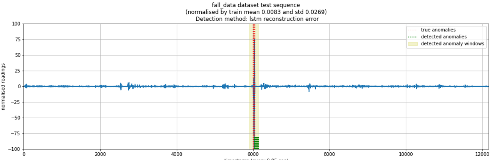
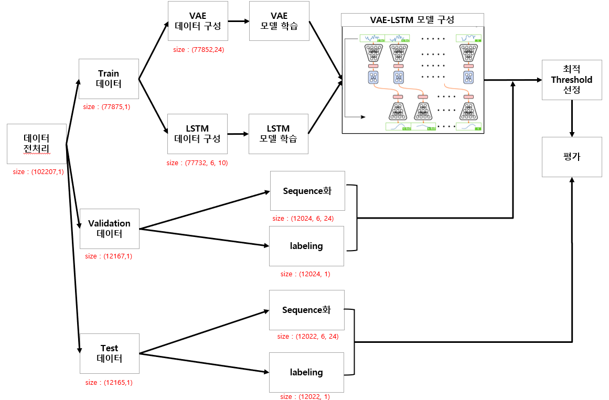
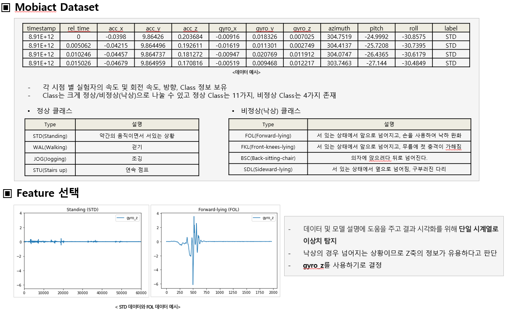
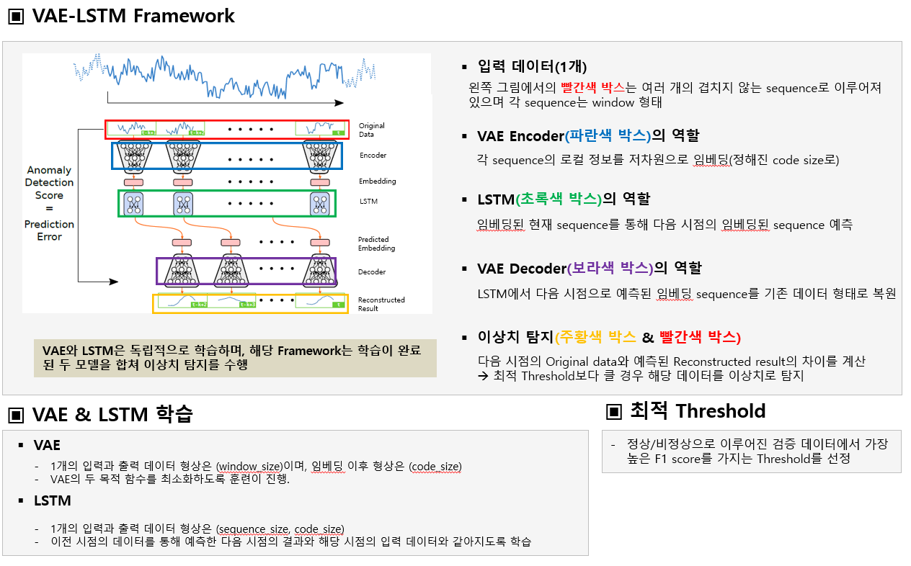

# VAE-LSTM_Fall_detection
- 석사 3기에 진행한 '고급 시계열 분석 및 예측' 수업에서 진행한 프로젝트
- 정상만 존재하는 시계열 데이터를 딥러닝 모델에 사용하여 이상치를 효과적으로 예측
- 프로젝트 취지가 서로 정보를 교류하는 것이 목적이므로 데이터 및 모델 설명에 도움을 주고 결과 시각화를 위해 단일 시계열로 이상치 탐지
- 'Anomaly detection for time series using vae-lstm hybrid model'에서 제안하는 VAE-LSTM 모델 사용

<p align="center"></p>
<br/>

## Workflow
<p align="center"></p>
<br/>


### 선행 설치 조건


```
matplotlib
sklearn
scipy
tqdm
numpy == 1.16.0
pandas == 0.25.3
GPy == 1.9.9
munch == 2.3.2
opencv-contrib-python==4.1.0.25
tensorflow-gpu == 1.15.2
tensorflow_probability == 0.7.0
```

### 사용 데이터
<p align="center"></p>
<br/>

<br/>

### VAE-LSTM Framework
<p align="center"></p>
<br/>

### 코드 파일 설명

- __Data_preprocessing.py__ : train, val, test 폴더에 있는 STD, FOL csv파일에서 gyro_z와 label만 가져와서 10개의 평균값으로 데이터 전처리  fall_gyro_z.csv, fall_label.csv, test_fall_gyro_z.csv, test_fall_label.csv 파일 생성

- __NAB-dataset-preprocessing.ipynb__ : 위에서 생성한 csv 파일들을 불러와서 데이터 표준화 실시. 이후 중요 정보들(val 및 test 데이터의 anomaly 위치, train과 val, test 시간 및 gyro_z 값 등)을 npz 파일로 저장  fall_data.npz, test_fall_data.npz 파일 생성

- __data_loader.py__ : npz 파일을 이용하여 VAE 입력 데이터와 LSTM 입력 데이터 생성  rolling_windows.npy, lstm_seq.npy 파일 생성

- __base.py__ : model.py에서 VAE model의 부모 클래스인 BaseModel 클래스에서는 VAE의 loss와 optimizer 설정 및 gradient 적용을 실시. BaseTrain 클래스는 trainers.py에서 vaeTrainer 클래스의 부모 클래스로 vaeTrainer의 train_epoch 함수를 호출해서 각 epoch마다 훈련을 진행

- __model.py__ : VAE model 클래스는 encoder, 잠재 변수 생성, decoder 과정으로 된 VAE에 대한 모델 구조를 생성. LSTM 클래스는 LSTM 모델 구조를 생성하고 VAE의 encoder를 통해 임베딩된 결과를 가져오며 훈련 방법까지 존재

- __trainers.py__ : VAE에 대한 각 epoch 훈련 과정이 명시되어 있으며 val, test 과정에서의 loss를 얻어 출력. 

- __train.py__ : base, model, trainers 파일을 이용하여 실질적인 VAE, LSTM 모델 학습 진행. 학습이 완료된 모델들은 개별적으로 저장

- __utils.py__ : config를 불러오거나 저장 경로에 대해 도움을 주는 여러 메소드로 구성

- __NAB-anomaly-detection.ipynb__ : 학습이 완료된 VAE, LSTM 파일을 불러 anomaly detection 진행. 검증 데이터로 최적 Threshold 설정 및 테스트 데이터로 평가 진행

- __ml-anomaly-detection.ipynb__ : 3가지 훈련 및 테스트 데이터를 이용하여 Isolation Forest 및 OCSVM 학습 및 평가


## 참조
```
Lin, S., Clark, R., Birke, R., Schönborn, S., Trigoni, N., & Roberts, S. (2020, May). Anomaly Detection for Time Series Using VAE-LSTM Hybrid Model. In ICASSP 2020-2020 IEEE International Conference on Acoustics, Speech and Signal Processing (ICASSP) (pp. 4322-4326). IEEE.
```
* [vae-lstm](https://github.com/lin-shuyu/VAE-LSTM-for-anomaly-detection)

<br/>

## 기여자

* 양동욱(dongwook412@naver.com)
* 황보성훈(thehb01@gmail.com)
